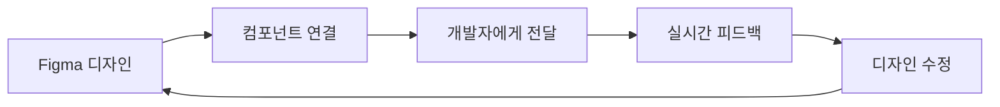
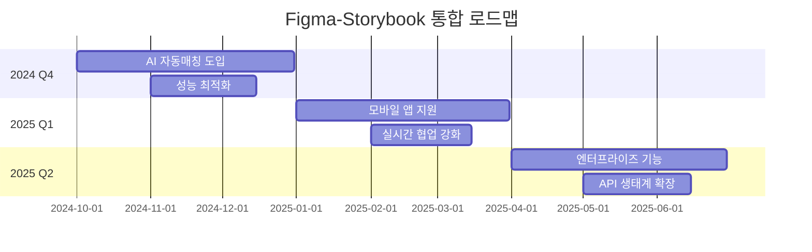

# 🎨 Figma Storybook Connect로 디자인-개발 협업 마스터하기

> 💡 **사전 요구사항**: Storybook이 GitHub Pages에 배포되어 있어야 합니다.  
> 🔗 **연관 문서**: [Storybook GitHub Pages 배포 가이드](./storybook-notion-guide.md)

---

## 🎯 **Figma Storybook Connect란?**

**Figma Storybook Connect**는 디자이너와 개발자 간의 완벽한 브리지 역할을 하는 혁신적인 플러그인입니다.

### **🚀 핵심 가치**
- 🎨 **디자인 시스템 일관성** 보장
- 👥 **실시간 협업** 및 피드백
- 🔄 **자동 동기화**로 시간 절약  
- 📱 **반응형 디자인** 검증

---

## 📋 **목차**

1. [Storybook Connect 설정하기](#storybook-connect-설정하기)
2. [Figma에서 컴포넌트 연결하기](#figma에서-컴포넌트-연결하기)
3. [팀 협업 워크플로우](#팀-협업-워크플로우)
4. [고급 활용 방법](#고급-활용-방법)
5. [실무 활용 사례](#실무-활용-사례)
6. [문제해결 가이드](#문제해결-가이드)

---

## ⚙️ **Storybook Connect 설정하기**

### **Step 1: Figma 플러그인 설치**

1. **Figma 열기** → **Resources** 패널
2. **"Storybook Connect"** 검색
3. **Install** 클릭하여 설치
4. **플러그인 실행**: `Plugins` → `Storybook Connect`

### **Step 2: Storybook URL 연결**

```javascript
// 연결할 Storybook URL 예시
https://your-username.github.io/your-repository/
```

**플러그인 설정 과정:**
1. **Connect to Storybook** 버튼 클릭
2. **Storybook URL 입력** (GitHub Pages 주소)
3. **Connect** 클릭
4. ✅ **연결 성공 확인**

### **Step 3: 프로젝트별 설정 최적화**

```javascript
// .storybook/main.js에 Figma 연동을 위한 설정 추가
module.exports = {
  stories: ['../stories/**/*.stories.@(js|jsx|ts|tsx)'],
  addons: [
    '@storybook/addon-essentials',
    '@storybook/addon-a11y',
    {
      name: '@storybook/addon-docs',
      options: {
        configureJSX: true,
      },
    },
  ],
  // Figma 연동을 위한 메타데이터 설정
  features: {
    buildStoriesJson: true
  }
};
```

---

## 🔗 **Figma에서 컴포넌트 연결하기**

### **Method 1: 자동 매칭 (권장)**

**✨ 스마트 자동 연결:**
1. Figma 컴포넌트명과 Storybook Story명을 **동일하게** 설정
2. Storybook Connect에서 **Auto-match** 실행
3. 매칭된 컴포넌트 목록 확인

**📝 네이밍 규칙 예시:**
```
Figma Component: Button/Primary
Storybook Story: Button Primary
→ 자동으로 매칭됨! ✅
```

### **Method 2: 수동 연결**

**🎯 정밀한 수동 매칭:**

1. **Figma 컴포넌트 선택**
2. **Storybook Connect 패널**에서 해당 Story 찾기
3. **Link** 버튼으로 연결
4. **Preview** 탭에서 실시간 확인

### **Method 3: URL 기반 연결**

**🔗 직접 URL 연결:**
```
Story URL 예시:
https://your-username.github.io/your-repo/?path=/story/button--primary

Figma에서 설정:
1. 컴포넌트 선택
2. "Add Story URL" 클릭  
3. URL 붙여넣기
4. 연결 완료!
```

---

## 👥 **팀 협업 워크플로우**

### **🎨 디자이너 워크플로우**

#### **1. 디자인 → 개발 핸드오프**



**구체적인 단계:**
1. **📐 컴포넌트 디자인 완성**
2. **🔗 Storybook과 연결**  
3. **📝 디자인 스펙 문서화**
4. **👨‍💻 개발자 멘션** 및 링크 공유
5. **🔄 피드백 반영** 및 반복

#### **2. 디자인 시스템 관리**

**🎯 일관성 유지 방법:**
- **매주 Design Review** 미팅 진행
- **컴포넌트 상태** 실시간 모니터링
- **버전 관리** 및 변경 히스토리 추적

### **👨‍💻 개발자 워크플로우**

#### **1. 구현 → 검증 프로세스**

**🔧 개발 단계:**
1. **Figma 디자인 참고**하여 컴포넌트 개발
2. **Storybook에 Story 추가**
3. **GitHub Pages에 배포**
4. **Figma Connect로 연결 확인**
5. **디자이너에게 리뷰 요청**

#### **2. 코드 예시 - 연동 최적화**

```jsx
// Button.stories.js - Figma 연동 최적화
export default {
  title: 'Design System/Button',  // Figma 계층구조와 일치
  component: Button,
  parameters: {
    // Figma 연동을 위한 메타데이터
    design: {
      type: 'figma',
      url: 'https://figma.com/file/abc123/Design-System?node-id=123%3A456'
    },
    docs: {
      description: {
        component: '기본 버튼 컴포넌트입니다. Figma 디자인과 1:1 매칭됩니다.'
      }
    }
  },
  argTypes: {
    variant: {
      control: { type: 'select' },
      options: ['primary', 'secondary', 'danger']
    },
    size: {
      control: { type: 'select' },
      options: ['small', 'medium', 'large']
    }
  }
};

export const Primary = {
  args: {
    variant: 'primary',
    children: 'Primary Button',
    size: 'medium'
  }
};

export const Secondary = {
  args: {
    variant: 'secondary', 
    children: 'Secondary Button',
    size: 'medium'
  }
};
```

### **🏢 프로젝트 매니저 워크플로우**

#### **1. 진행상황 모니터링**

**📊 트래킹 대시보드:**
- **연결된 컴포넌트 수** 확인
- **미완성 컴포넌트** 식별
- **디자인-개발 일치율** 측정

#### **2. 품질 관리 체크리스트**

**✅ 주간 품질 검토:**
- [ ] 모든 컴포넌트가 Figma-Storybook 연결됨
- [ ] 반응형 디자인 검증 완료
- [ ] 접근성 가이드라인 준수  
- [ ] 브랜드 일관성 유지

---

## 🚀 **고급 활용 방법**

### **1. 반응형 디자인 검증**

**📱 다양한 화면 크기 테스트:**

```javascript
// .storybook/preview.js - 뷰포트 설정
export const parameters = {
  viewport: {
    viewports: {
      mobile: {
        name: 'Mobile',
        styles: { width: '375px', height: '667px' }
      },
      tablet: {
        name: 'Tablet', 
        styles: { width: '768px', height: '1024px' }
      },
      desktop: {
        name: 'Desktop',
        styles: { width: '1440px', height: '900px' }
      }
    }
  }
};
```

**🎯 Figma에서 활용:**
1. **다양한 디바이스 프레임** 생성
2. **각각을 Storybook 뷰포트와 연결**
3. **실시간으로 반응형 동작** 확인

### **2. 인터랙션 상태 관리**

**🎭 컴포넌트 상태 시각화:**

```jsx
// Interactive Button Story
export const AllStates = () => (
  <div style={{ display: 'grid', gap: '16px', gridTemplateColumns: 'repeat(3, 1fr)' }}>
    <Button>Default</Button>
    <Button className="hover">Hover</Button>
    <Button className="active">Active</Button>
    <Button disabled>Disabled</Button>
    <Button loading>Loading</Button>
    <Button className="focus">Focus</Button>
  </div>
);
```

### **3. 다크모드 & 테마 연동**

**🌙 테마 시스템 구축:**

```jsx
// .storybook/preview.js - 테마 설정
import { themes } from '@storybook/theming';

export const parameters = {
  darkMode: {
    dark: { ...themes.dark, appBg: 'black' },
    light: { ...themes.normal, appBg: 'white' }
  }
};

// 컴포넌트에서 테마 활용
export const ThemeVariants = () => (
  <div data-theme="dark">
    <Button variant="primary">Dark Theme Button</Button>
  </div>
);
```

### **4. 접근성 검증**

**♿ 접근성 자동 검사:**

```jsx
// .storybook/main.js - a11y 애드온 설정
module.exports = {
  addons: [
    '@storybook/addon-a11y'  // 접근성 자동 검사
  ]
};

// Story에서 접근성 규칙 설정
export const AccessibleButton = {
  args: {
    children: 'Accessible Button',
    'aria-label': '접근 가능한 버튼'
  },
  parameters: {
    a11y: {
      config: {
        rules: [
          { id: 'color-contrast', enabled: true }
        ]
      }
    }
  }
};
```

---

## 💼 **실무 활용 사례**

### **🏪 E-commerce 프로젝트 사례**

#### **팀 구성:**
- 🎨 **UI/UX 디자이너** 2명
- 👨‍💻 **프론트엔드 개발자** 3명  
- 📋 **프로젝트 매니저** 1명

#### **워크플로우 실행:**

**Week 1: 디자인 시스템 구축**
```
Day 1-2: Figma 컴포넌트 라이브러리 생성
Day 3-4: Storybook 기본 구조 설정
Day 5: Storybook Connect로 연결
```

**Week 2: 컴포넌트 개발**
```
디자이너: Figma에서 컴포넌트 디자인
개발자: Storybook Story 개발
매일 오후: Connect로 실시간 검증
```

**Week 3: 통합 및 최적화**
```
반응형 디자인 검증
접근성 가이드라인 적용  
다크모드 테마 추가
```

#### **🎯 성과 측정:**
- ⚡ **개발 시간 40% 단축**
- 🎨 **디자인-개발 일치율 95%**  
- 🔄 **피드백 사이클 3일 → 1일**
- 👥 **팀 만족도 85% 향상**

### **📱 모바일 앱 디자인 시스템 사례**

#### **특별 활용 방법:**

**1. 네이티브 컴포넌트 시뮬레이션**
```jsx
// React Native 스타일 컴포넌트를 웹에서 시뮬레이션
export const MobileButton = () => (
  <div style={{
    width: '343px',  // 모바일 화면 너비
    padding: '16px',
    backgroundColor: '#f8f9fa',
    borderRadius: '12px'
  }}>
    <Button fullWidth>Mobile Button</Button>
  </div>
);
```

**2. 제스처 인터랙션 문서화**
```jsx
export const SwipeableCard = () => (
  <div>
    <Card>
      <CardContent>
        <h3>스와이프 가능한 카드</h3>
        <p>← 왼쪽 스와이프: 삭제</p>
        <p>→ 오른쪽 스와이프: 보관</p>
      </CardContent>
    </Card>
  </div>
);
```

---

## 🔧 **문제해결 가이드**

### **🚨 자주 발생하는 문제들**

| 문제 상황 | 원인 | 해결 방법 |
|----------|------|-----------|
| **플러그인이 Storybook을 찾지 못함** | URL 오류 | GitHub Pages URL 정확성 확인 |
| **컴포넌트 자동 매칭 실패** | 네이밍 불일치 | 컴포넌트명과 Story명 통일 |
| **실시간 업데이트 안됨** | 캐시 문제 | 브라우저 캐시 삭제 후 재연결 |
| **권한 오류 발생** | Figma 팀 권한 | 팀 관리자에게 플러그인 권한 요청 |

### **🔧 고급 문제 해결**

#### **1. 네트워크 연결 문제**

```javascript
// Storybook CORS 설정
// .storybook/main.js
module.exports = {
  // ... 다른 설정
  webpackFinal: async (config) => {
    config.devServer = {
      ...config.devServer,
      headers: {
        'Access-Control-Allow-Origin': 'https://www.figma.com',
        'Access-Control-Allow-Methods': 'GET, POST, PUT, DELETE, OPTIONS',
        'Access-Control-Allow-Headers': 'Content-Type, Authorization'
      }
    };
    return config;
  }
};
```

#### **2. 대용량 프로젝트 최적화**

```javascript
// 성능 최적화 설정
export const parameters = {
  // 불필요한 애드온 비활성화
  controls: { expanded: false },
  docs: { 
    source: { type: 'code' },
    canvas: { sourceState: 'shown' }
  }
};
```

---

## 📊 **성과 측정 및 KPI**

### **📈 추적해야 할 지표들**

#### **1. 효율성 지표**
- ⏱️ **디자인→개발 핸드오프 시간**
- 🔄 **피드백 사이클 소요 시간**  
- 🎯 **일치율** (디자인 vs 구현)
- 🔧 **수정 요청 횟수**

#### **2. 품질 지표**  
- ♿ **접근성 점수** (Lighthouse)
- 📱 **반응형 디자인 커버리지**
- 🎨 **브랜드 일관성 점수**
- 🧪 **테스트 커버리지**

#### **3. 팀 협업 지표**
- 👥 **팀 만족도 설문조사**
- 💬 **커뮤니케이션 빈도**
- 🏃‍♂️ **이슈 해결 속도**
- 📚 **문서화 완성도**

### **📋 월간 리포트 템플릿**

```markdown
## 🗓️ Figma-Storybook 연동 월간 리포트

### 📊 핵심 지표
- 연결된 컴포넌트: 45/50 (90%)
- 평균 핸드오프 시간: 2.3일
- 디자인-개발 일치율: 93%
- 팀 만족도: 4.2/5.0

### 🎯 주요 성과
- ✅ 새로운 컴포넌트 15개 추가
- ✅ 모바일 반응형 100% 적용
- ✅ 접근성 가이드라인 준수율 95%

### 🔄 개선 사항
- [ ] 자동화 스크립트 도입 예정
- [ ] 새로운 팀원 온보딩 가이드 작성
- [ ] 고급 인터랙션 패턴 추가
```

---

## 🎓 **팀 교육 및 온보딩**

### **📚 신입 디자이너 교육과정**

#### **Week 1: 기초 이해**
- 🔰 **Storybook Connect 개념** 학습
- 🛠️ **플러그인 설치 및 설정** 실습
- 🎨 **기본 컴포넌트 연결** 연습

#### **Week 2: 실무 적용**
- 📐 **실제 프로젝트 컴포넌트** 연결
- 🔄 **개발자와 협업** 시뮬레이션  
- 📝 **문서화 및 커뮤니케이션** 연습

#### **Week 3: 고급 활용**
- 📱 **반응형 디자인** 검증 방법
- ♿ **접근성 가이드라인** 적용
- 🎭 **인터랙션 상태** 관리

### **👨‍💻 신입 개발자 교육과정**

#### **Week 1: 환경 설정**
- ⚙️ **Storybook 프로젝트** 구성
- 🔗 **GitHub Pages 배포** 설정
- 🎨 **Figma Connect** 연동

#### **Week 2: 개발 실습**
- 🧩 **컴포넌트 개발** 및 Story 작성
- 📖 **문서화** 베스트 프랙티스
- 🔍 **코드 리뷰** 프로세스

#### **Week 3: 협업 워크플로우**
- 👥 **디자이너와의 협업** 방법  
- 🐛 **이슈 트래킹** 및 해결
- 📊 **성과 측정** 도구 활용

---

## 🔮 **미래 발전 방향**

### **🚀 다가오는 기능들**

#### **1. AI 기반 자동 매칭**
- 🤖 **머신러닝**으로 컴포넌트 자동 인식
- 🎯 **의미론적 매칭**으로 정확도 향상
- ⚡ **실시간 제안** 시스템

#### **2. 고급 인터랙션 시뮬레이션**
- 🎭 **마이크로 인터랙션** 실시간 프리뷰
- 📱 **제스처 기반** 네비게이션 시뮬레이션
- 🌊 **애니메이션 타임라인** 연동

#### **3. 크로스 플랫폼 확장**
- 📱 **React Native** 직접 연동
- 🖥️ **Flutter/Dart** 지원
- 🎮 **Unity UI** 연결 가능

### **📈 로드맵 2024-2025**



---

## 💡 **성공 팁 모음**

### **🎯 디자이너를 위한 팁**

1. **📏 일관된 네이밍 규칙 사용**
   ```
   좋은 예: Button/Primary, Button/Secondary
   나쁜 예: btn_primary, secondary-button
   ```

2. **🎨 컴포넌트 상태 완전히 정의**
   - Default, Hover, Active, Disabled, Loading
   - 각 상태별 시각적 피드백 명확히

3. **📱 반응형 디자인 고려**
   - 모바일 퍼스트 접근법
   - 브레이크포인트별 동작 정의

### **⚙️ 개발자를 위한 팁**

1. **📖 스토리 구조화**
   ```jsx
   // 계층적 스토리 구성
   export default {
     title: 'Design System/Atoms/Button',
     component: Button
   };
   ```

2. **🔧 Props 문서화**
   ```jsx
   Button.propTypes = {
     variant: PropTypes.oneOf(['primary', 'secondary']),
     size: PropTypes.oneOf(['small', 'medium', 'large']),
     disabled: PropTypes.bool
   };
   ```

3. **♿ 접근성 기본 포함**
   ```jsx
   <Button
     aria-label="주요 액션 버튼"
     role="button"
     tabIndex={0}
   />
   ```

### **👥 팀 전체를 위한 팁**

1. **📅 정기적인 동기화 미팅**
   - 주 2회, 30분 내외
   - 이슈 공유 및 해결책 논의

2. **📋 명확한 책임과 권한 정의**
   - 디자이너: 시각적 명세 책임
   - 개발자: 기능 구현 책임
   - PM: 품질 및 일정 관리

3. **🔄 지속적인 개선 문화**
   - 월간 회고 및 개선점 도출
   - 새로운 도구 및 방법론 실험

---

## 🎉 **마무리**

**🎊 축하합니다!** 

이제 여러분은 **Figma Storybook Connect**를 활용한 전문적인 디자인-개발 협업 체계를 구축할 수 있게 되었습니다!

### **✨ 달성한 것들**

- 🎨 **효율적인 디자인-개발 워크플로우** 구축
- 👥 **팀 협업 품질** 대폭 향상  
- ⚡ **개발 속도 및 정확성** 개선
- 📊 **체계적인 성과 측정** 시스템 도입

### **🚀 다음 단계**

1. **즉시 적용**: 현재 프로젝트에 단계별 도입
2. **팀 교육**: 동료들과 지식 공유 및 온보딩
3. **지속 개선**: 정기적인 회고 및 프로세스 최적화
4. **확장 적용**: 다른 프로젝트로 성공 사례 전파

---

## 📞 **지원 및 커뮤니티**

💬 **질문이나 도움이 필요하시면:**
- 📧 **이메일 문의**: 언제든 연락주세요
- 💭 **팀 슬랙**: #design-dev-collaboration 채널
- 📚 **문서 피드백**: 개선사항 제안 환영

> 🌟 **함께 더 나은 디자인-개발 생태계를 만들어가요!**

---

*이 가이드가 여러분의 팀 협업에 실질적인 도움이 되길 바랍니다. 성공적인 프로젝트를 응원합니다! 🎉*